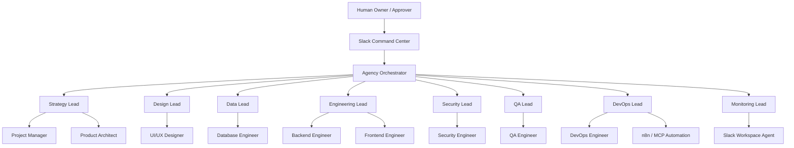
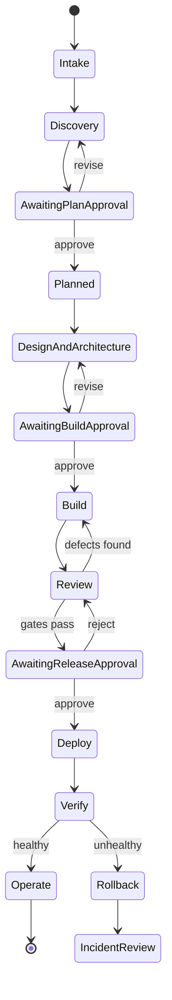

# BitBirr AI Software Agency — Hierarchy, Workflow, Automation, and Approval Blueprint

Version: 1.0  
Owner: BitBirr Technology Solutions  
Primary human interface: Slack  
Workflow orchestrator: n8n  
System of record: self-hosted Supabase/PostgreSQL  
Semantic memory: Qdrant  
Planning and documentation: Asana + Notion  
Deployment target: Railway, with separate production infrastructure workflows where required

## 1. Recommended hierarchy

The attached agents should not operate as an unstructured peer group. Add one top-level **Agency Orchestrator** that owns routing and lifecycle state but does not replace departmental judgment.



### Authority order

1. **Human Owner / Approver** — owns business intent, budget, risk acceptance, production authorization, and final release approval.
2. **Agency Orchestrator** — routes work, enforces lifecycle transitions, checks evidence, pauses for approval, and prevents agents from bypassing gates.
3. **Department Leads** — own decisions and sign-offs within their discipline.
4. **Specialist Sub-agents** — execute bounded work delegated by their lead.
5. **n8n and Slack agents** — automate and communicate; they do not independently redefine scope or authorize risky actions.

## 2. Core operating model

Use a **supervisor-led, stage-gated workflow**. A task may run in parallel within a stage, but it may not move to the next stage until all required outputs and gates are satisfied.



### Canonical project states

`intake`, `discovery`, `awaiting_plan_approval`, `planned`, `designing`, `awaiting_build_approval`, `building`, `reviewing`, `blocked`, `awaiting_release_approval`, `deploying`, `verifying`, `operating`, `incident`, `rolling_back`, `completed`, `cancelled`.

Only the Agency Orchestrator may change the canonical project stage. Agents submit a **transition request** with evidence; the orchestrator validates it and writes the transition to Supabase.

## 3. Full execution workflow

### Stage 0 — Slack intake

**Trigger:** A human starts a project or feature from an approved Slack channel or command.

**Sequence:**

1. Slack Workspace Agent captures the command, requestor, channel, thread timestamp, attachments, and urgency.
2. n8n verifies the requestor against the authorization matrix.
3. n8n creates an idempotency key from `workspace + channel + thread + command`.
4. Agency Orchestrator creates or resumes the project/run in Supabase.
5. Slack receives a thread reply containing the run ID, interpreted goal, current stage, and next action.

**Required output:** Intake record with objective, stakeholders, desired outcome, constraints, deadline, risk level, and source thread.

### Stage 1 — Strategy and discovery

**Owner:** Strategy Lead  
**Parallel sub-work:** Project Manager + Product Architect

1. Strategy Lead clarifies objective, target users, success metrics, constraints, and exclusions.
2. Project Manager produces epics, vertical stories, Given/When/Then acceptance criteria, estimates, dependencies, milestone plan, and risk register.
3. Product Architect maps the current system, defines boundaries, integrations, API direction, non-functional requirements, and ADRs.
4. Strategy Lead reconciles both outputs into one decision-ready project brief.
5. n8n creates or updates the Asana project/tasks and Notion PRD/ADR pages.
6. Slack posts a compact approval card.

**Human Gate A — Plan approval:** Required before detailed design or implementation. Human may `approve`, `revise`, `reject`, or `cancel`.

### Stage 2 — Design, data, security, and delivery planning

**Parallel owners:** Design Lead, Data Lead, Security Lead, DevOps Lead  
**Input:** Approved strategy brief and architecture baseline

- Design Lead defines information architecture and user flows; UI/UX Designer produces tokens, components, responsive states, and accessibility specifications.
- Data Lead defines data ownership, lifecycle, relational versus vector storage, retention, embedding model/dimensions, and retrieval policy; Database Engineer drafts reversible migrations, roles, RLS, indexes, and Qdrant collection changes.
- Security Lead produces threat model, trust boundaries, data classification, authentication/authorization model, and mandatory controls; Security Engineer reviews the concrete design.
- DevOps Lead defines dev/staging/prod topology, CI gates, promotion, rollback, observability, and automation plan.
- Product Architect checks all outputs for boundary and contract consistency.

**Required integration artifact:** A versioned build contract containing API schema, events, database migration plan, UI states, security controls, test obligations, environment variables by name only, deployment plan, and rollback method.

**Human Gate B — Build authorization:** Required when scope, architecture, cost, new third-party services, PII handling, or one-way-door decisions are confirmed.

### Stage 3 — Implementation

**Owner:** Engineering Lead  
**Parallel sub-work:** Backend Engineer + Frontend Engineer; Database Engineer as dependency owner

1. Engineering Lead freezes the versioned interface contract for the iteration.
2. Database changes are prepared and tested in dev/staging; production remains prohibited.
3. Backend and frontend implement vertical slices against the same contract.
4. Each pull request must include linked Asana task, acceptance criteria, tests, security notes, migration/rollback notes where applicable, and observable proof.
5. Engineering Lead integrates and runs the full build/test path.
6. Monitoring hooks and structured events are added before the slice is called complete.

**Automated checks:** formatting, linting, types, unit tests, integration tests, build, secret scanning, dependency scanning, migration validation, and artifact generation.

### Stage 4 — Independent review

**Owners:** QA Lead + Security Lead  
**Supporting owners:** QA Engineer + Security Engineer

- QA Lead maps acceptance criteria to the test plan and sets the release threshold.
- QA Engineer executes unit, integration, E2E, negative, accessibility, performance, and regression tests as applicable.
- Security Engineer checks authN/authZ, tenant isolation, RLS, secrets, injection, SSRF, XSS/CSRF, dependencies, configuration, and data exposure.
- QA Lead gives `PASS` or `FAIL` with evidence.
- Security Lead gives `GO`, `CONDITIONAL GO`, or `NO-GO`; critical/high findings block release.

The producing engineering agents may fix defects, but they may not approve their own work.

### Stage 5 — Release approval and deployment

**Owner:** DevOps Lead  
**Executor:** DevOps Engineer  
**Communication:** Monitoring Lead + Slack Workspace Agent

**Human Gate C — Production release:** Required for every production deployment. Approval must name project, release/version, environment, change set, risk, rollback target, and expiry time.

Deployment sequence:

1. Reconfirm unexpired approval and exact target.
2. Run sanitized preflight.
3. Verify required backups for stateful changes.
4. Deploy the smallest safe scope.
5. Execute smoke tests, health checks, real-hostname/TLS checks, auth-boundary checks, and key user journeys.
6. Observe the defined stabilization window.
7. Mark success or trigger automatic pause/rollback policy.
8. Post result and evidence to the existing Slack release thread.

### Stage 6 — Operations, monitoring, and closure

**Owner:** Monitoring Lead  
**Executor:** Slack Workspace Agent + n8n workflows

- Watch availability, latency, error rate, queue/background failures, resource saturation, security signals, deployment health, and selected business metrics.
- Use one Slack thread per incident as the timeline and source of truth for humans.
- Create incidents/tasks automatically at the configured severity.
- After stabilization, Project Manager closes completed Asana tasks; Strategy Lead compares results to success metrics.
- The Orchestrator stores a concise project summary, decisions, incidents, and reusable lessons in Supabase and indexes approved knowledge in Qdrant.

## 4. Human approval matrix

| Action | Approval required | Who may approve | Minimum evidence | Approval expiry |
|---|---|---|---|---|
| Approve project scope/plan | Yes | Product owner / founder | scope, exclusions, estimate, risks, milestones | 7 days or material change |
| Begin implementation | Yes | Product owner or delegated technical owner | build contract, cost impact, security/data classification | 7 days or contract revision |
| Create/update Asana or Notion records | No for routine sync; yes for destructive changes | Workspace owner for destructive actions | diff/target list | 24 hours |
| Post routine status in approved project thread | No | Policy-based | run ID and source evidence | n/a |
| Broadcast high-stakes/public Slack message | Yes or draft-first | Channel owner / incident commander | final draft, target channel | 2 hours |
| Send external email via Resend | Yes unless template/campaign pre-approved | Business owner | recipients/category, template, purpose | 2 hours |
| Send SMS | Always | Authorized human | recipient class, count, content, cost | 30 minutes |
| Apply staging migration | Policy-based approval | Technical owner | tested migration, rollback, backup when stateful | 4 hours |
| Apply production DB/Qdrant mutation | Always | Infrastructure/data owner | verified backup, exact statements/change, blast radius, rollback | 30 minutes |
| Change RLS/auth/secrets/firewall/DNS/TLS | Always | Security + infrastructure owner | threat/risk review, exact diff, recovery plan | 30 minutes |
| Deploy to staging | Policy-based | Technical owner | green CI and deploy manifest | 4 hours |
| Deploy to production | Always | Product owner / release manager | QA PASS, Security GO, backup, rollback, release manifest | 30 minutes |
| Roll back during active incident | Pre-authorized only to last known-good release | Incident commander or emergency policy | health trigger and known-good target | incident duration |
| Delete data, resources, workflows, tasks, pages, or channels | Always | Resource owner | exact targets, impact, recovery method | 15 minutes |
| Accept residual high/critical security risk | Always; cannot be delegated to AI | Human business and security owner | finding, impact, compensating controls, expiry | explicit date |

### Approval rules

1. Silence, emoji alone, or an unrelated Slack reply is not approval.
2. Valid approval must be an explicit command or signed interactive action tied to an `approval_id`.
3. Approval is scoped to one action, target, environment, and version; it cannot be reused.
4. Any material diff after approval invalidates it.
5. Self-approval is forbidden: the requesting agent and executing agent cannot approve.
6. Expired approvals move the run back to `awaiting_*_approval`.
7. Rejection must capture a reason; revision creates a new artifact version and approval request.
8. n8n must re-read approval state from Supabase immediately before the side effect.

## 5. Slack command-center design

### Recommended channels

| Channel | Purpose | Noise policy |
|---|---|---|
| `#ai-agency-command` | Human commands, approvals, executive status | Only commands and major stage changes |
| `#ai-agency-delivery` | Sprint, PR, CI, QA, and release summaries | Thread per project/release |
| `#ai-agency-incidents` | P1/P2 incidents and security events | One incident = one thread |
| `#ai-agency-approvals` | Pending approval cards and outcomes | No conversational chatter |
| `#ai-agency-audit` | Append-only automation and policy events | Bot-only where possible |

The existing `#ceo` channel may remain the executive entry point, but operational detail should be routed into dedicated channels and threads.

### Commands

```text
/agency new <project> <goal>
/agency status <project|run-id>
/agency plan <project>
/agency pause <project|run-id> <reason>
/agency resume <project|run-id>
/agency approve <approval-id>
/agency reject <approval-id> <reason>
/agency revise <approval-id> <instruction>
/agency deploy <project> <environment> <version>
/agency rollback <deployment-id>
/agency incident <service> <summary>
/agency memory <project> <query>
/agency help
```

### Message contract

Every bot message must include, where relevant:

- project and run ID;
- stage and status;
- owner agent;
- concise result or impact;
- evidence links to Asana, Notion, repository/CI, or deployment;
- approval ID and expiry when waiting;
- exact next action;
- no secrets or sensitive payloads.

## 6. n8n automation catalogue

| Automation | Trigger | Key actions | Human gate |
|---|---|---|---|
| Intake Router | Slack `/agency new` or approved mention | validate user, dedupe, create run, invoke Strategy Lead, open thread | No |
| Context Assembly | New/resumed run | load project config and memories from Supabase; retrieve relevant Qdrant context; generate bounded context pack | No |
| Planning Sync | Strategy artifacts completed | update Asana backlog and Notion PRD/ADRs; post summary | Plan approval |
| Stage Gate Controller | Agent transition request | validate required artifacts/sign-offs; write state transition; dispatch next lead | Depending on gate |
| Approval Manager | Gate reached | create approval row, Slack card, reminder, expiry, decision audit | Yes |
| CI Event Handler | PR/CI webhook | correlate task/run, update status, notify thread, dispatch QA on green | No |
| Review Coordinator | Build complete | invoke QA and Security independently; aggregate verdicts | No, but release remains gated |
| Release Orchestrator | Approved deployment | preflight, backup verification, deploy, smoke test, stabilization, result | Production approval |
| Incident Router | Alert webhook | dedupe, classify severity, open incident/thread, page owner, start cadence | P1 remediation actions may require gate |
| Notification Digest | Scheduled | summarize progress, blockers, approvals, usage/cost | No |
| Knowledge Finalizer | Stage/release closure | summarize validated decisions/results; store relational memory; embed approved content in Qdrant | No |
| Stale Work Watcher | Scheduled | flag stalled runs/tasks, ask owner, escalate after threshold | No |
| Cost Guard | Model/tool usage event | aggregate usage, warn at thresholds, pause at hard limit | Human approval to raise limit |

### n8n reliability rules

- Every workflow has a correlation/run ID and idempotency key.
- Every external mutation uses retry with exponential backoff only when safe.
- Non-idempotent steps use a durable outbox or deduplication record.
- Each workflow has explicit success, failure, timeout, and dead-letter branches.
- Credentials live in n8n credential storage or an approved secrets system, never nodes or prompts.
- Workflow versions are documented, exported, reviewed, and rollback-ready.
- A workflow cannot mark its own side effect successful solely from HTTP 200; it must verify the resulting state.
- Failed workflows notify Slack with owner, impact, retry status, and recovery action.

## 7. Memory and source-of-truth rules

### Supabase/PostgreSQL stores authoritative state

Use the existing `agent_memory` schema and expand only through reviewed migrations. Canonical records should include projects, runs, messages, artifacts, approvals, deployments, model usage, repositories, stage transitions, tool executions, incidents, and notification deliveries.

Recommended additions:

- `stage_transitions(id, project_id, run_id, from_stage, to_stage, requested_by, validated_by, evidence, created_at)`
- `tool_executions(id, run_id, agent, tool, action_class, target, idempotency_key, approval_id, status, sanitized_result, created_at)`
- `incidents(id, project_id, severity, status, service, commander, slack_thread_ts, started_at, resolved_at)`
- `notification_deliveries(id, run_id, channel_id, thread_ts, message_type, dedupe_key, status, created_at)`

### Qdrant stores retrieval memory, not authority

Store approved PRDs, ADRs, conventions, summaries, incident lessons, and knowledge chunks. Each vector payload should carry `project_id`, `document_id`, `version`, `memory_type`, `classification`, `source`, `created_at`, and `superseded`.

Rules:

1. Qdrant content must reference an authoritative Supabase record.
2. Never use vector similarity alone to approve, deploy, mutate, or authorize.
3. Retrieval-only agents receive read-only Qdrant credentials.
4. Sensitive secrets, raw credentials, and unnecessary PII are never embedded.
5. Superseded memories remain traceable but are excluded from normal retrieval.
6. Context packs are bounded, ranked, deduplicated, and labeled as facts, decisions, assumptions, or historical notes.

### Asana, Notion, Slack, and repositories

- **Asana:** work status, assignment, deadlines, dependencies, acceptance criteria.
- **Notion:** human-readable PRDs, ADRs, runbooks, design and operational documentation.
- **Git repository/CI:** code, migrations, infrastructure definitions, tests, immutable build evidence.
- **Slack:** commands, approvals, coordination, incident timeline, summaries—not durable project truth.
- **Supabase:** canonical machine state and audit trail connecting all systems.

## 8. Global rules for every agent

1. Operate only within the assigned project, run, role, and stage.
2. Read the current project state and approved artifact versions before acting.
3. Do not invent missing facts. Record assumptions and request clarification when the answer changes scope, cost, security, data, or release behavior.
4. Leads decide and delegate; specialists execute and return evidence.
5. Every delegation includes goal, inputs, constraints, expected artifact, acceptance criteria, deadline, and allowed tools.
6. Every completion response includes status, output/artifact reference, evidence, risks, blockers, and recommended next transition.
7. No agent may claim tests, scans, backups, deploys, messages, or database changes occurred without tool-generated evidence.
8. No agent may approve its own output or bypass an approval gate.
9. External writes and production mutations follow least privilege, exact target resolution, and idempotency rules.
10. Secrets are referenced only by variable/credential name, never read into prompts, logs, Slack, memory, or artifacts.
11. Production changes require preflight, verified backup when stateful, smallest scope, verification, and rollback readiness.
12. Destructive actions require explicit, fresh, target-specific human approval.
13. High/critical QA or security blockers stop release. Only a human may accept residual risk, with expiry and compensating controls.
14. A failed step produces a blocker or incident, not a fabricated success.
15. All decisions and state transitions are auditable and correlated by project ID and run ID.
16. Agent-to-agent messages are structured; free-form prose is for explanation, not control state.
17. Parallel work is allowed only when dependencies and contracts are stable.
18. The orchestrator detects loops, caps retries/handoffs, and escalates repeated failure to a human.
19. Human commands can pause or cancel any run. Cancellation prevents new side effects but preserves the audit trail.
20. The final project closure requires operational verification, documentation sync, memory finalization, and a human-readable Slack summary.

## 9. Agent handoff contract

Every agent result should use this envelope:

```json
{
  "project_id": "uuid",
  "run_id": "uuid",
  "stage": "building",
  "agent": "backend-engineer",
  "status": "completed|blocked|failed|needs_approval",
  "summary": "Short factual result",
  "artifacts": [{"type": "api_contract", "uri": "...", "version": "v3"}],
  "evidence": [{"type": "test_run", "uri": "...", "result": "passed"}],
  "decisions": [],
  "risks": [],
  "blockers": [],
  "requested_transition": "reviewing",
  "approval_required": false,
  "next_owner": "qa-lead"
}
```

The orchestrator rejects a handoff when required artifacts or evidence are absent, artifact versions do not match the approved build contract, the requested transition is illegal, or approval is missing/expired.

## 10. Definition of done

A feature or project is complete only when:

- acceptance criteria are satisfied with linked test evidence;
- build, lint, type, integration, and required E2E checks pass;
- QA verdict is PASS;
- Security verdict is GO or a human-approved, time-bounded conditional exception exists;
- database migrations and rollback are verified where applicable;
- deployment is approved, executed, and verified in the target environment;
- monitoring and alerting are active;
- Asana and Notion are synchronized;
- Slack contains the final factual summary and links;
- Supabase contains the complete audit trail;
- reusable, non-sensitive knowledge is finalized in Qdrant;
- no unresolved critical/high defect remains.

## 11. Recommended implementation order

1. Create the Agency Orchestrator and canonical state machine.
2. Add structured handoff and approval schemas in Supabase.
3. Build the Slack intake/status/approve/reject/pause commands.
4. Implement n8n Intake Router, Context Assembly, and Stage Gate Controller.
5. Connect Strategy outputs to Asana and Notion.
6. Add CI Event Handler and independent QA/Security review workflow.
7. Add production Release Orchestrator with approval expiry, backup verification, smoke tests, and rollback.
8. Add Incident Router, digests, stale-work watcher, and cost guard.
9. Run tabletop tests for approval bypass, duplicate Slack events, stale context, failed deploy, failed rollback, leaked-secret prevention, and incident escalation.

This order establishes control and auditability before granting the agents broader automation power.
