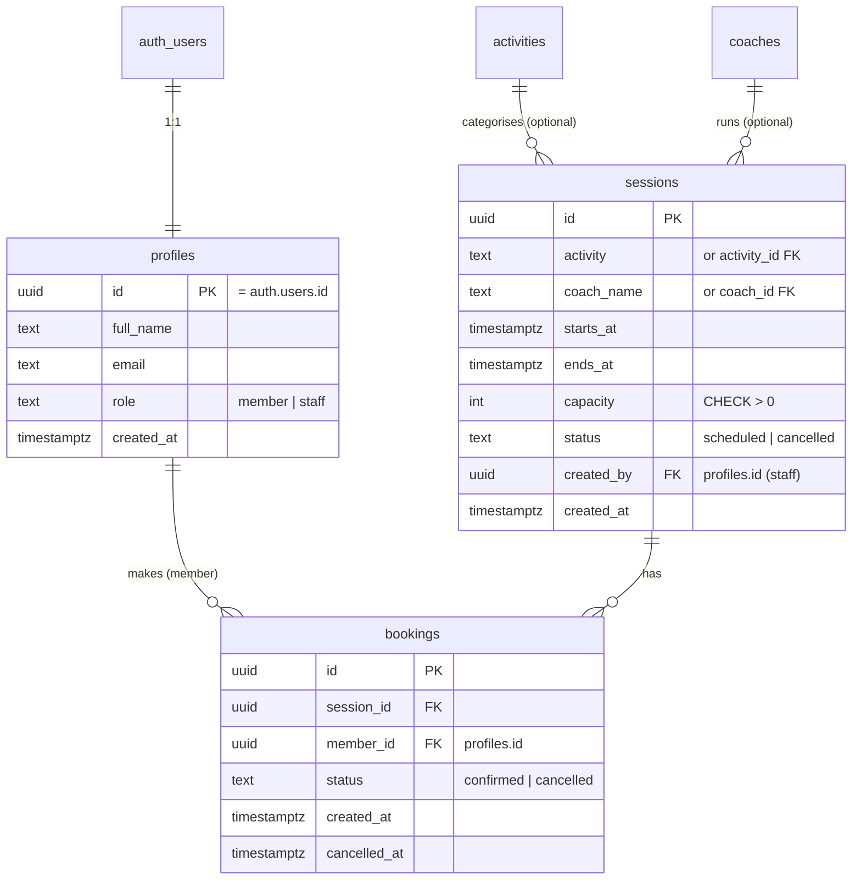

# Data model — Simple Gym Booking System

Status: Proposed. **Input for the data/database engineer** to turn into
Supabase migrations (`supabase/migrations/`). This describes entities,
relationships, ownership, and the constraints/indexes that enforce the
capacity and uniqueness rules. It is intentionally implementation-close but not
a migration; the data engineer owns exact types, naming, and RLS policy SQL.

Database: self-hosted Supabase PostgreSQL 17.6. Auth users live in
`auth.users` (managed by Supabase). Application tables live in the `public`
schema unless the team standardises on another.

---

## 1. Entities & ownership

| Entity | Table | Owner / writer | Purpose |
|---|---|---|---|
| Member / staff profile | `profiles` | self (limited) / admin sets role | App-level identity + role, 1:1 with `auth.users`. |
| Activity (optional lookup) | `activities` | staff | Type of class (Yoga, Spin…). Optional; can start as a text field on `sessions`. |
| Coach (optional lookup) | `coaches` | staff | Who runs the session. Optional for MVP; may be free text initially. |
| Session / class instance | `sessions` | staff | A single scheduled, bookable occurrence with a capacity. |
| Booking | `bookings` | member (own) / staff read | A member's reservation of a session. |

MVP simplification: `activities` and `coaches` can begin as plain text columns
on `sessions` (`activity`, `coach_name`) to save build time, and be normalised
into lookup tables later (two-way door). This document lists both so the data
engineer can choose based on whether staff need to manage a coach/activity list
in MVP (see open Q).

---

## 2. Relationships (ERD)



---

## 3. Key columns and enums

- `profiles.role` — enum-like text `('member','staff')`, default `'member'`.
  Not self-writable (RLS). Consider a real `create type ... as enum`.
- `sessions.status` — `('scheduled','cancelled')`. **Note:** "full" is NOT a
  stored status. Fullness is derived from live booking counts (see §5). This
  prevents status drift.
- `sessions.capacity` — `int`, `CHECK (capacity > 0)`.
- `sessions.starts_at` / `ends_at` — `timestamptz`; `CHECK (ends_at > starts_at)`.
- `bookings.status` — `('confirmed','cancelled')`. Design the enum so a future
  `waitlisted` value is additive.
- `bookings.member_id` — FK → `profiles.id`. `session_id` FK → `sessions.id`.
  Decide `ON DELETE` (recommend `RESTRICT`/soft-cancel over hard delete to
  preserve history).

---

## 4. The constraints that enforce correctness (must-have)

These two are the load-bearing constraints for backlog item 6. See
`adr/0002-capacity-enforcement.md`.

1. **No duplicate active booking — partial unique index:**

   ```sql
   CREATE UNIQUE INDEX bookings_one_active_per_member
     ON bookings (session_id, member_id)
     WHERE status = 'confirmed';
   ```

   Guarantees at most one confirmed booking per (member, session); allows
   re-booking after cancellation because cancelled rows fall outside the index.

2. **No overbooking — transactional function (not a column):**
   Enforced by `book_session()` which locks the session row and counts
   confirmed bookings inside one transaction before inserting. There is
   deliberately **no** stored `booked_count` to drift. If a hard DB-level cap is
   also wanted as a belt-and-braces check, it must be a trigger that counts
   under the same lock — but the function is the primary guarantee.

Booking creation RPC (the only sanctioned create path), shape for the engineer:

```sql
create or replace function book_session(p_session_id uuid)
returns bookings
language plpgsql
security definer
set search_path = public
as $$
declare
  v_capacity int;
  v_count    int;
  v_row      bookings;
begin
  -- lock the session row: serialises concurrent bookers of THIS session
  select capacity into v_capacity
    from sessions
   where id = p_session_id and status = 'scheduled'
   for update;

  if not found then
    raise exception 'session_not_available' using errcode = 'P0001';
  end if;

  select count(*) into v_count
    from bookings
   where session_id = p_session_id and status = 'confirmed';

  if v_count >= v_capacity then
    raise exception 'session_full' using errcode = 'P0002';
  end if;

  insert into bookings (session_id, member_id, status)
  values (p_session_id, auth.uid(), 'confirmed')
  returning * into v_row;   -- partial unique index raises on duplicate

  return v_row;
exception
  when unique_violation then
    raise exception 'duplicate_booking' using errcode = 'P0003';
end;
$$;
```

The engineer should map the three custom errcodes to typed API results
(`session_full`, `duplicate_booking`, `session_not_available`).

---

## 5. Availability view (derived, never stored)

```sql
create view session_availability as
select
  s.*,
  coalesce(b.confirmed_count, 0)                as confirmed_count,
  greatest(s.capacity - coalesce(b.confirmed_count,0), 0) as remaining,
  (coalesce(b.confirmed_count,0) >= s.capacity) as is_full
from sessions s
left join (
  select session_id, count(*) as confirmed_count
    from bookings
   where status = 'confirmed'
   group by session_id
) b on b.session_id = s.id;
```

Start as a plain view. If the count query becomes hot, promote to a materialised
view refreshed on booking change (two-way door — measure first).

---

## 6. Indexes

| Index | Purpose |
|---|---|
| `bookings_one_active_per_member` (partial unique, §4) | Correctness: no duplicate active booking. |
| `bookings (session_id) WHERE status = 'confirmed'` | Fast confirmed-count for availability and the RPC. |
| `bookings (member_id)` | My-bookings lookup (item 3). |
| `sessions (starts_at)` | Catalogue query filtered by date range (item 1). |
| `sessions (status, starts_at)` | Browse future scheduled sessions efficiently. |

---

## 7. RLS policy intent (engineer to write SQL)

Enable RLS on `profiles`, `sessions`, `bookings` (default deny).

- `profiles`: SELECT/UPDATE only `id = auth.uid()`; `role` immutable by the
  member (enforce via column-level rule or a trigger).
- `sessions`: SELECT public or authenticated (per assumption A2);
  INSERT/UPDATE/DELETE only when caller's role claim = `staff`.
- `bookings`: SELECT/INSERT/UPDATE only where `member_id = auth.uid()` for
  members; staff SELECT all (roster). Note the create path is the
  `security definer` RPC — ensure the INSERT policy still permits it or that the
  RPC's definer role is appropriate.

---

## 8. Lifecycle notes

- **Cancel booking (member):** UPDATE status → `cancelled`, set `cancelled_at`.
  Frees a spot immediately (availability is derived).
- **Cancel session (staff):** UPDATE `sessions.status` → `cancelled` and cascade
  its confirmed bookings to `cancelled` (in one transaction). Decide whether
  members are notified (out of scope MVP; n8n seam later).
- **Capacity shrink (staff):** does not auto-cancel members over the new cap;
  `remaining` clamps at 0. Auto-bump policy is an open question (Q3).
- **History:** prefer soft-cancel over delete to retain booking history for
  future reporting.

---

## 9. Open questions for the data engineer / product

- Normalise `activities` and `coaches` into lookup tables in MVP, or keep as
  text on `sessions` and normalise later?
- Confirm `ON DELETE` behaviour for FKs (recommend RESTRICT + soft-cancel).
- Confirm whether a belt-and-braces capacity trigger is wanted in addition to
  the RPC.
- Recurring sessions (weekly series) are out of MVP scope (assumption A3) —
  confirm before schema is frozen, since a series/`recurrence` concept is
  easier to add up front than to retrofit.
